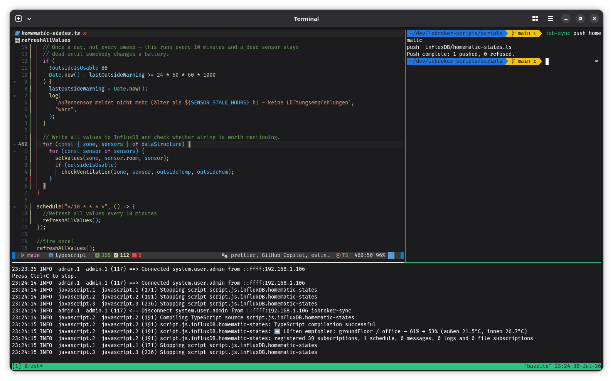

# iobroker-sync

Edit your ioBroker scripts as ordinary files, in any editor, under version control.

ioBroker keeps JavaScript and TypeScript scripts inside its object database, reachable
only through the Admin web UI. That means no git history, no code review, no diffs, no
search across scripts, no editor of your choice, and no way to touch them from a script
or a CI job. `iobroker-sync` maps them to a local folder and keeps the two in step.



## Quick start

```bash
npm install -g iobroker-sync
```

```bash
mkdir ~/iobroker-scripts && cd ~/iobroker-scripts

iob-sync init      # asks for the URL and username, then verifies the connection
iob-sync login     # only if your instance has authentication enabled
iob-sync pull      # your scripts are now files in ./scripts
iob-sync types     # teach your editor what log(), schedule(), on() are

$EDITOR scripts/common/garage.ts
iob-sync status    # what changed
iob-sync push      # send it back
```

That is the whole loop. `git init` in that folder and your home automation has history.

The commands worth knowing on day one:

|                   |                                                                           |
| ----------------- | ------------------------------------------------------------------------- |
| `iob-sync pull`   | bring the server's scripts down                                           |
| `iob-sync status` | what differs, locally and remotely                                        |
| `iob-sync push`   | send your edits up                                                        |
| `iob-sync logs`   | watch script output — **this is how you find out a push actually worked** |
| `iob-sync backup` | snapshot everything before you touch something important                  |

## Why this exists

Scripts that run a house are production code, and the Admin UI cannot treat them that
way: no history to roll back to at 23:00, no diffs, no multi-file search, no LSP, and
nothing that can automate a backup or a deployment. Once the scripts are files, all of
that comes free from tools you already have.

## iobroker-sync or the VS Code extension?

The [ioBroker JavaScript VS Code extension](https://github.com/nokxs/iobroker-javascript-vs-code-extension)
by nokxs solves the same core problem and inspired this tool. If you work in VS Code, it
is genuinely good and does things a CLI cannot — go use it.

|                                       | iobroker-sync       | VS Code extension |
| ------------------------------------- | ------------------- | ----------------- |
| Editor                                | any, or none        | VS Code           |
| State-ID autocompletion, hover values | —                   | yes               |
| Script tree, buttons, context menus   | — (`iob-sync list`) | yes               |
| Works over SSH, in CI, headless       | yes                 | —                 |
| Machine-readable output               | yes                 | —                 |
| Scriptable from a shell or an agent   | yes                 | —                 |

Rough rule: **if you live in VS Code, use the extension.** If you want your own editor, a
git-first workflow, or anything automated, use this. They are not exclusive — both talk
to the same Admin API, and this tool never writes fields it does not own.

## How it works

`iob-sync` operates on the folder holding `.iobroker-sync.json`, found by searching
upward the way `git` finds `.git`:

```
~/iobroker-scripts/            <- project root
├── .iobroker-sync.json        <- config. Commit it; it holds no password.
├── .iobroker-sync/            <- state, backups, trash. Gitignored.
└── scripts/                   <- your scripts land here
    └── common/garage.ts       <- script.js.common.garage
```

Run `init` **in** the folder you want the scripts in — `scriptRoot` is a subfolder of the
project and cannot point outside it.

→ **[CONFIGURATION.md](docs/CONFIGURATION.md)** for the config fields, id-to-path mapping,
pattern syntax and editor setup.

## The edit loop

```bash
iob-sync watch          # pushes on save; --pull also applies remote changes
```

**`push` only tells you the source was uploaded.** The javascript adapter compiles it
afterwards, so a syntax error or a throw on load appears in the ioBroker log and nowhere
else. Watch it from a second terminal:

```bash
iob-sync logs                  # everything, info and above
iob-sync logs garage           # only lines mentioning "garage"
iob-sync logs --level error    # only failures
```

If `logs` shows nothing at `info` and above while scripts are demonstrably running, that
is a bug and not your instance — see [TROUBLESHOOTING.md](docs/TROUBLESHOOTING.md).
Missing `debug` lines specifically are usually the adapter's own log level.

## Commands

**Sync**

| Command            | Description                                                                                                                                                                                     |
| ------------------ | ----------------------------------------------------------------------------------------------------------------------------------------------------------------------------------------------- |
| `init`             | Write `.iobroker-sync.json`, verify the connection, create the script folder. Asks interactively when run without flags. `--types` also sets up TypeScript definitions.                         |
| `types`            | Set up editor intellisense (`log`, `schedule`, ...). `--force`, `--offline`.                                                                                                                    |
| `login` / `logout` | Save or remove the password for this instance. Never stored in the project.                                                                                                                     |
| `trust`            | Accept the instance's current TLS certificate. Only needed after it changes. `--yes` skips the prompt.                                                                                          |
| `doctor`           | Check config, certificate, login, connection, a live round-trip and leftover adapter markers, and say which one is wrong. Read-only, never prompts. Run this first when something looks broken. |
| `pull [pattern]`   | Download scripts to disk. Never deletes or overwrites local files.                                                                                                                              |
| `push [pattern]`   | Upload locally modified scripts. Never deletes remote objects.                                                                                                                                  |
| `status`           | Show what changed, locally and remotely.                                                                                                                                                        |
| `diff [pattern]`   | Unified diff of local vs server. `--against <snapshot>` compares with a backup instead.                                                                                                         |
| `watch`            | Push on save. `--pull` also applies remote changes.                                                                                                                                             |
| `logs [pattern]`   | Stream the server log. `--level`, `--limit`. Read-only.                                                                                                                                         |
| `backup [pattern]` | Snapshot every script — source _and_ full object — to `.iobroker-sync/backup/<timestamp>/`. Read-only against the server.                                                                       |

**Lifecycle**

| Command                                  | Description                                                                                                                                                                                                                                 |
| ---------------------------------------- | ------------------------------------------------------------------------------------------------------------------------------------------------------------------------------------------------------------------------------------------- |
| `list`                                   | All scripts with instance and enabled state.                                                                                                                                                                                                |
| `start` / `stop` / `restart` `<pattern>` | Toggle `common.enabled`.                                                                                                                                                                                                                    |
| `new <path>`                             | Create a new script (disabled) plus any missing folders.                                                                                                                                                                                    |
| `rename` / `move` / `remove`             | Destructive. Require `--yes` and back up the object first. `remove` keeps the local file unless `--delete-local`. All three also clean up the `scriptEnabled`/`scriptProblem` states the old id leaves behind on every javascript instance. |

`--dry-run`, `--verbose`, `--json` and `-C <dir>` are global and work with every command.
When in doubt, `--dry-run` shows what would happen and changes nothing.

## Safety model

This tool talks to a live home-automation system, and is deliberately conservative:

- **`pull` never deletes a local file, and never silently overwrites one.** A script that
  would land on an existing untracked file is reported as a conflict instead.
- **`push` never deletes remote objects**, and writes only `common.source` and
  `common.engineType`. It _cannot_ disable a running script or move it between javascript
  instances, because it never sends those fields — a sync bug structurally cannot stop
  your heating.
- **Conflicts block.** A manifest records the hash at last sync, so "you changed it",
  "the server changed it" and "both changed" are distinguished; the last refuses without
  `--force`.
- **Deletion is always explicit.** Only `remove`, `rename` and `move` delete anything,
  all require `--yes`, and each writes the full object to `.iobroker-sync/trash/` first.
- **`backup` gives you a restore point**, storing each full object as well as the source
  — so it is the only record of which instance a script ran on and whether it was
  enabled.

```bash
iob-sync backup
# ...edit, break something...
iob-sync diff --against latest    # what changed since the snapshot?
```

## Authentication

Instances without authentication need no setup. Otherwise:

```bash
iob-sync login       # prompts without echoing, verifies, then saves
```

**Your password is never stored in the project.** It goes to
`~/.config/iobroker-sync/credentials.json`, mode `0600`, outside your repo. There is
deliberately no `--password` flag: `argv` is readable via `ps` and kept in shell history.

→ **[AUTHENTICATION.md](docs/AUTHENTICATION.md)** for HTTPS, self-signed certificates,
`--password-stdin` and CI usage.

## Scripting and automation

`--json` puts [NDJSON](https://ndjson.org) on stdout — one object per line, tagged with a
`type`. Warnings and errors stay on stderr, so stdout stays parseable even on failure.

```bash
# Fail a CI job if anything drifted from git
test -z "$(iob-sync --json status | jq -rc 'select(.state != "in-sync")')"
```

→ **[AUTOMATION.md](docs/AUTOMATION.md)** for record shapes and more examples.

## Known limitations

- **Verified against Admin 7.x only.** Older versions are likely to work — the legacy
  login path exists for them — but the wire protocol has not been checked against them.
- **Self-signed certificates** are accepted only when `allowSelfSigned` is set. The
  certificate is then pinned on first connection and verified on every one after that,
  so a change is caught — but the first connection itself is trusted blindly.
- **`Blockly` and `Rules` scripts** are pulled for completeness, but their sources are
  generated and editing them by hand is not supported.

## Docs

- **[CONFIGURATION.md](docs/CONFIGURATION.md)** — config fields, mapping, patterns, editor setup
- **[AUTHENTICATION.md](docs/AUTHENTICATION.md)** — passwords, HTTPS, CI
- **[AUTOMATION.md](docs/AUTOMATION.md)** — `--json` record shapes, CI and agent usage
- **[TROUBLESHOOTING.md](docs/TROUBLESHOOTING.md)** — things that look like bugs and are not
- **[DEVELOPMENT.md](docs/DEVELOPMENT.md)** — running from a clone, tests, contributing
- **[AGENTS.md](AGENTS.md)** — architecture, wire protocol, safety invariants. Written for
  AI coding agents, but the fastest way for a human to understand the codebase too.
- **[CHANGELOG.md](CHANGELOG.md)** — release history
- **[SECURITY.md](SECURITY.md)** — how to report a vulnerability, and the deliberate trade-offs

## License

MIT — see [LICENSE](LICENSE).
